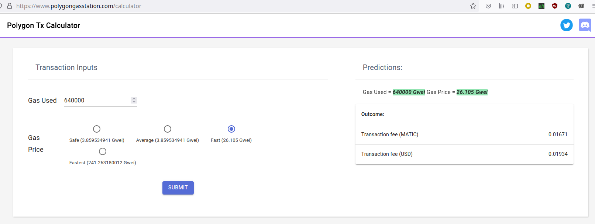

# Provider Notarization

This proposal is an effort to achieve following goals:

* Decentralize discovery and provider monitoring (verification), effectively removing Mysterium’s special value from Mysterium protocol.
* Shift all expenses of proposal monitoring to providers, establishing healthy economics for proposal maintenance.
* Establish a flexible framework for custom provider properties (claims) which can be a subject of validation. Also we can notarize providers which provide some free services for consumers and distribute bounty across them based just on their notarization status and availability. And vice versa, we can offer subsidized notarization services if a provider makes that commitment.
* Solve issue of heavy provider list downloaded each time from discovery (at this moment 1.4 MB for 2700 proposals).
* Add real censorship resistance at least to the network control plane. Ensure consumers can discover providers as long as they are able to pay.
* Protect the network from proposal flood and eliminate few vectors of low-cost DoS attacks.

## Notary

New workflow delegates all monitoring (quality, availability) and discovery functions to separate entities - **notaries**. Notary has following responsibilities:

1. Accept requests from providers for proposal attestation. Proposal attestation is performed by notary by validation of known claims stated in proposal. These claims may include quality and speed parameters, availability guarantees, specific web-service geo-unlocking capabilities. On successful attestation notary adds attestation record to blockchain.
2. Revoke attestation once provider violated constraints certified for it's proposal and publish revocation record on blockchain.
3. Accept availability announcements from providers. Providers will send them periodically.
4. Publish Aggregated Provider Presence Data periodically (explained below).
5. *(Optional, convenience feature)* Provide a convenient way to query proposals with filtering.

Notaries operate a kind of business similar to PKI Certificate Authorities. It charges a notarization fee for a proposal, sufficient to cover expenses for issuance, potential revocation and continuous monitoring of that proposal (if certified claims imply that). Matter of trust to particular notaries is, same as with PKI CAs, up to consumers and providers. Mysterium protocol implementation vendors may define a default list of trusted notaries and end users may override it. Providers choose the best value/price for them.

Blockchain is used as a log of attestations because of 2 reasons:

* It is considered always available to consumers, directly or indirectly. Otherwise consumers are not able to pay for services.
* Blockchain serves here the same purpose as [Certificate Transparency log](https://en.wikipedia.org/wiki/Certificate_Transparency), making work of notaries audible. There is no way a notary can attestate provider without making it public.

## Aggregated Provider Presence Data

APPD is a set of proposals available online at this moment. It is packed into a [Bloom filter](https://en.wikipedia.org/wiki/Bloom_filter) in order to reduce its overall size. For the current number of proposals (~2700) and false positive probability equal to 0.1%, its size will be ~4900 bytes, regardless of size of individual element. One million of proposals will require Bloom filter with size about 1.71MB.[^1]

Amortized packing density for Bloom filter is *1.44log2(1/ε)*, where *ε* is a false positive probability, i.e. ~14.35 bits for 0.1% false positive rate. Having APPD published once per 5 minutes, it will require 288 publications per day and amortized space cost ~517 bytes per provider.

There are few options to consider for publishing APPD:

1. **Cheapest.** Establish a well-known link for fresh APPD. It can be hosted on IPFS (via IPNS binding), S3, CDNs etc.
2. **Strictest.** Publish it directly on blockchain. Amortized price is about 1 cent per day for a provider, which is affordable.
3. **Mixed.** Publish a new link on blockchain from time to time. Not necessarily once in 5 minutes, just to rotate the link.

Also there are few possible directions to improve APPD packing:

* **Towards precision.** Since the universe set of proposals is known at each blockchain block number, it is possible to make this structure deterministic, enumerating proposal keys <proposal_id, service_type> which are known to be false positive at this snapshot.[^2]
* **Towards space efficiency.** There are more space-efficient alternatives to Bloom filter around, which offer higher density:
  * Xor-filter (*1.23log2(1/ε)* bits per element)
  * Cuckoo-filter (*1.047(log2(1/ε) + 3)* bits per element)
  * 4-wise binary fuse (*1.075log2(1/ε)* bits per element)

[^1]: [Bloom Filter Calculator](https://hur.st/bloomfilter/)
[^2]: [Bloom Filter with a False Positive Free Zone](http://lendulet.tmit.bme.hu/lendulet_website/wp-content/papercite-data/pdf/kiss2018bloom.pdf)

## Complete workflow

### Provider side

1. Starts service as usual and sends periodic notifications to the notary.
2. Forms desired claims for service proposal and requests proposal notarization from notary.
3. Notary calculates its expenses for proposal maintenance and charges the provider.
4. Provider pays the notary.
5. Once the notary has finished validation, it publishes the notarized proposal.
6. Notary continues monitoring of the proposal to revoke it in case of claim violation.

### Consumer side

1. Recovers list of active (not expired, not revoked) proposals from blockchain and caches it. It will not change frequently.[^3]
2. Retrieves the most recent APPD set.
3. Filters proposals matching required claims, also checking if the proposal is in the APPD set.
4. Connects to a service of its choice, using provider contact from the proposal.

### Notary

According to duties defined for it earlier.

[^3]: For practical reasons it is worth considering providing snapshots of active proposals the same way as Option 3 for APPD publishing.

## Appendix A. Price of 1KByte on Polygon blockchain.

## Appendix B. Messaging cost estimation.

Proposal size with basic set of claims in protobuf format is about 100-200 bytes.[^4] With any possible overhead and extensions we can assume it’s 500 bytes. So, it’s price with current gas price (average because of low urgency) will be about $0.001 USD. Revocation will require just the ID of the service proposal, but let's assume it is $0.001 USD too.

APPD publication is more urgent, so let’s take a fast price, which is $0.02 per kilobyte. Amortized space for one provider is 517 bytes per day, so it will be about $0.01 per day.
For current volume (2700 proposals), APPD publication will cost ~$30 per day.

[^4]: [https://play.golang.org/p/YzZ9Y2zGEsm](https://play.golang.org/p/YzZ9Y2zGEsm)
